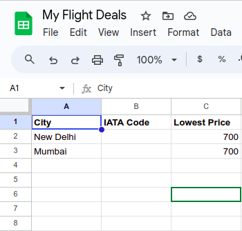
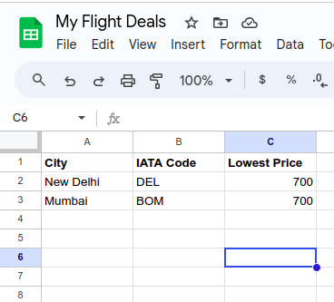
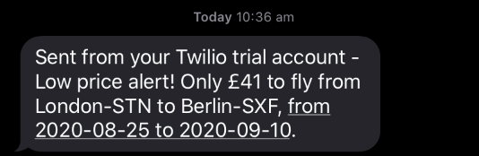
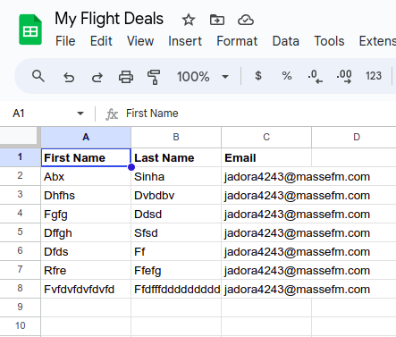
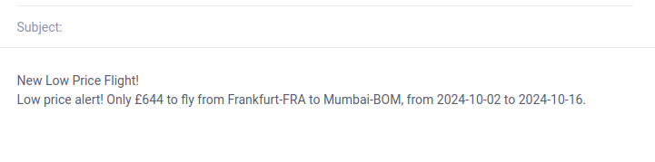

# Flight Deal Program - (Cheap Flight finder)

## Description

This program is designed to help users find the best flight deals based 
on their preferences. It utilizes various APIs and algorithms to search 
for and present the most cost-effective flight options.

## Features

- **Flight Search**: Search for flights based on specified criteria such as destination, departure date, and budget.

- **Deal Notifications**: Receive notifications when great flight deals matching your criteria are found.

## How to strat

1. Use Sheety to Read and Write Data to the Google Sheet:

   The goal for this step is to read and write some data to the Google Sheet. This way you can check if Sheety is working correctly before connecting the Kiwi Partners Flight Search API and getting the actual IATA codes for each city to the Google Sheet.
   
   1. Go to the [link](https://docs.google.com/spreadsheets/d/1FiTY-4DjKXeMUq3n57x0A2goQqNei1HC0hbN65QqVcM/edit#gid=0]) for the starting Google Sheet and make your own copy of it. Then create a new project on Sheety to work with your copy of the Google sheet.

3. Get the IATA Codes using the Kiwi Partners API
   
   Add the City IATA Codes to your Google Sheet
In order to search for flights, we need an [International Air Transport Association (IATA) code](https://en.wikipedia.org/wiki/IATA_airport_code). This code helps to identify airports and metropolitan areas.

Some airports are so famous that people even refer to the IATA code in normal conversation. e.g LAX and JFK.

Some cities have multiple airports so they have their own city IATA code which is different from the airport IATA code. e.g. LON (London) - LHR (Heathrow)/ LGW(Gatwick) etc.

The goal for this step is to add the missing IATA codes for each city to the Google Sheet.



   1. Make requests using the Kiwi Partners Tequila API

      NOTE: You'll have to [sign up (free) for an account with Tequila](https://partners.kiwi.com/) to access their flight search API. Double check the instructions in Step 1 to make sure you've selected the correct options. Then take a look at the locations API -> search by query.


      

3. Send an SMS using Twilio OR send email to listed customer email in google sheet
   1. Send an SMS using Twilio
      The final step is to check if any of the flights found are cheaper than the Lowest Price listed in the Google Sheet. If so, then we should use the [Twilio API](https://www.twilio.com/docs/sms/quickstart/python) to send an SMS with enough information to book the flight. 
      
      
   2. Send email to listed customer email in google sheet
      Customer will register via their name and email. These data will be store in our Google sheet. If flight found cheper than we will send email with our message that we have found cheper fligt with date and price.
      

      
      
## Installation

1. Clone the repository:

    ```bash
    git https://github.com/kcvaghasiya/flight-deals.git
    cd flight-deal
    ```

2. Configure API Keys:

    Obtain API keys for the necessary services ([Sheety](https://sheety.co/), [Kiwi Partners Tequila API](https://partners.kiwi.com/) , [Twilio](https://www.twilio.com/docs/sms/quickstart/python) etc.) and update the envrionment variable with your keys.

4. Run the program:

    ```bash
    python main.py
    ```
